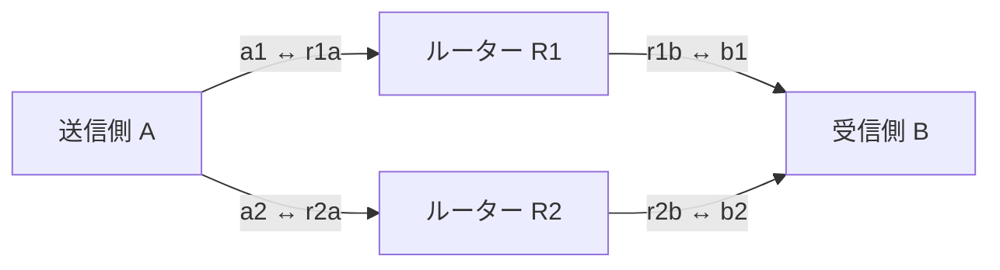

# amitoki-plugin-l3

amitokiのL3中継プラグインと、独自プロトコルの実験・比較環境。[動的経路・混雑通知・Web観測](docs/adaptive-fabric.md)、[プラグインの導入](docs/plugin.md)、[設計と次の用途](docs/design-direction.md)を参照する。

Ethernetの直上に独自ヘッダを載せ、短文の優先転送、受信側による送信量の制限、期限切れの破棄、2経路への複製を比較する試作。IP・TCP・UDPは使わない。Linuxのraw socketを使う別実行ファイル `amitoki-l3` として実装している。

`bench`の既定は**信頼性のある順序なし配送**。通信グループごとに順序保証を選べる。[信頼性配送の使い方と仕様](reliable-delivery.md)を参照。従来の期限内ACK率の実験は`--delivery deadline`で実行する。「比較試験を実行する」から「期限付きモードで送信枠・優先キュー・期限を適用する」までの説明は、主にdeadlineモードを対象にする。

[修正後の比較結果](docs/results-2026-09-28.md)では、全60試行の完了と、混雑時の遅延・帯域・CPUの交換条件を確認した。

信頼性配送とTCPの比較は[同じ負荷でL3とTCPを比べる](tcp-comparison.md)を参照。順序なし・順序ありのL3と、TCPの1接続・2接続を全件配送後の遅延・速度で比べる。

## パケットの構造

L3の通信はEthernetの直上に載る。外側のEthernetヘッダは次のリンクのMAC宛て、AMTKヘッダは最終宛先のノードIDを持つ。ルーターはリンクごとにMACを書き換え、AMTKの`hops`を減らして転送する。

```text
Ethernet frame
+------------------+-------------------+----------------------------+
| Ethernet: 14 B   | AMTK v2: 96 B     | payload: 0..1400 B         |
+------------------+-------------------+----------------------------+
         |                                    |
         +-- dst MAC: 6 B                      +-- deadline: body
         +-- src MAC: 6 B                      +-- reliable: prefix + body
         +-- EtherType: 2 B (0x88B5)

reliable payload
+-------------------+----------------------------------------------+
| prefix: 16 B      | body: up to 1384 B                           |
+-------------------+----------------------------------------------+
```

最大サイズは`14 + 96 + 1400 = 1510B`。EthernetのMTUに数える部分は`96 + 1400 = 1496B`で、MTU 1500に収まる。図とサイズにはFCS・preamble・IFGを含めない。信頼性配送のDATA本文はshort最大240B、bulk最大1384B。[共通ヘッダ](#共通ヘッダ96b)、[信頼性配送](#信頼性配送のprefixと応答)、[プラグインの断片化](#プラグインが運ぶethernetフレーム)を以下に示す。

## 比較試験を実行する

Linux、Rust、Docker Engineを使う。Ubuntuでの導入コマンドは[比較環境の準備](comparison.md#準備する)を参照する。このcrate単体のビルドにはNode.jsとプラグインのsubmodule取得は不要。

リポジトリのルートで実行する。Dockerを実行できるユーザーで使う。

```bash
cargo test -p amitoki-l3-lab --locked
bash scripts/test-l3.sh
```

スクリプトがreleaseビルドと試験用イメージの作成を行い、外部非接続のコンテナを起動する。コンテナ内にだけvethと遅延設定を作り、終了時に削除する。イメージの初回ビルドではパッケージの取得にネットワーク接続を使う。

既定は期限付き配送18条件を各3秒・3回、その後に信頼性配送10条件を1回。短い確認は次で実行する。CIも同じ設定を使う。

```bash
L3_REPETITIONS=1 L3_DURATION_MS=1000 bash scripts/test-l3.sh artifacts/l3/quick
```

出力先の既定値は `artifacts/l3/<JST日付>/<時刻>/`。実験ごとに新しいディレクトリを指定する。

| ファイル | 内容 |
|---|---|
| `report.md` | 各回の期限内ACK率とRTT |
| `measurements.json` | 全ノードの計測値と試験条件 |
| `verification.json` | 成否、カーネル、実行ファイルのSHA256 |
| `reliable/verification.json` | 信頼性配送10条件の検証結果 |
| `reliable/<条件>/deliveries.jsonl` | アプリへ渡したchannel・sequence・本文 |
| `<回>-<条件>/*.json` | ノード設定、起動通知、ノード別レポート |
| `<回>-<条件>/sample.pcap` | 先頭128フレームまでの実通信 |
| `<回>-<条件>/*.log` | プロセスの出力 |

失敗時は各条件の `.log` を確認する。`creditを取得できません` は、受信側から送信許可が戻らなかったことを示す。ルーター不在の条件では、この失敗を確認する。再現情報を共有する場合は、[Issue](https://github.com/amitoki/amitoki-plugin-l3/issues)に条件と `verification.json` を添える。

## 2本の経路を独立したルーターで中継する



4プロセス・4組のvethを、1個のコンテナのネットワーク名前空間に置く。各vethにはIPアドレスを付けず、ブリッジも作らない。AとBの間には必ずRustのルーターが入る。別VMを4台使う構成ではない。

ルーターの各出力を1Mbpsに制限する。短文は128バイトを毎秒100件、背景負荷は1200バイトを毎秒500件。これは混雑を再現する条件であり、実装の最大帯域ではない。帯域計算はEthernetヘッダを含み、FCS・preamble・IFGは含まない。

| 条件 | 確かめること |
|---|---|
| `idle_fifo` / `idle_priority` | 無負荷時のFIFOと優先制御 |
| `congested_fifo` / `congested_priority` | 背景負荷がある場合の短文の遅延 |
| `delayed_single` / `delayed_dual` | 主経路に30msの遅延がある場合の1経路と2経路 |
| `delayed_no_replica_budget` | 複製帯域を0にすると複製されないこと |
| `primary_loss_dual` | 主経路の送信を100%捨てても別経路で届くこと |
| `dual_duplicates` | 同じ本文が2経路で届いても配送は1回であること |
| `receiver_limited` | 受信側が毎秒20件に送信枠を制限すること |
| `retry_delayed` | 8ms遅延・再送1回でも重複配送しないこと |
| `missing_router` | ルーターなしでは到達しないこと |
| `clock_offsets` / `clock_drift` | 数秒の時計差と、相対400ppmの進み方の差があっても同期すること |
| `clock_asymmetric` | 片方向1msの遅延を誤差区間に含めて通信すること |
| `clock_holdover` / `clock_recovery` | 同期断で送信を止め、同期が戻ったら再開すること |
| `clock_too_uncertain` | 誤差が上限を超える経路では期限付き通信を止めること |

主経路の遅延・欠落はR1からBへの片方向に設定する。逆方向は正常。2経路の分だけ利用できる資源も増えるため、帯域の等しい1経路との性能比較にはなっていない。

短文の期限は既定20ms、背景負荷は200ms。再送試験だけ短文を50msにする。**期限内ACK率は、送信予定の全メッセージに対する成功率**。送信枠不足、キューの満杯、期限切れ、ACKが戻らないものも分母に含む。RTTの開始は送信予定時刻なので、ローカルで待った時間も含まれる。p50/p99は期限内ACKが返ったメッセージだけの値であり、成功率と併せて読む。

試験は配送数、送信枠と複製帯域の上限、期限、重複処理、EtherType、hop数の減算を検査する。CIではホスト負荷で変わるp99の性能閾値は設けない。

JSONの `benchmark.*.sent` は、有効な送信枠を消費して転送処理へ渡したメッセージ数。後段のキューでの破棄も含む。socketから実際に送信できたフレーム数は `network.sent` に記録する。期限切れと不正な送信枠による拒否は別々に集計する。

## 期限付きモードで送信枠・優先キュー・期限を適用する

1. 時計同期を設定した場合は基準ノードとの時刻交換を行う。送信側が `REQUEST` を送り、受信側が許可した件数を `GRANT` で返す。開始時の交換を終えてから計測する。
2. 送信側が枠を1件消費し、メッセージID・期限・本文を持つ `DATA` を出す。枠がなければその送信予定分を失敗に数える。
3. ルーターは時計、期限、hop数を確認し、宛先と経路IDで次のリンクを選ぶ。各出力の有界キューと帯域制限を通して転送する。
4. 受信側が枠と本文を検証する。最初の有効な到着だけを配送として数え、本文のfingerprintを `ACK` で返す。
5. 送信側は同じメッセージの正しいACKが期限内に戻った場合だけ成功に数える。

枠は送信元・起動ごとのsession・クラスに結び付ける。要求の再送や2経路からの同一要求は同じGRANTを返すので、許可数が増えない。短文と背景負荷には別々のtoken bucketを使う。受信側全体の毎秒の許可数を設定し、初期バーストは各32件まで。受信側が空き帯域を推定して自動調整するアルゴリズムは未実装。

優先キューは制御32件、短文32件、背景負荷128件分の空間を確保する。短文は期限が近いものから出す。制御が4件、短文が8件続いたら、待っている他クラスにも送信機会を与える。FIFO比較では同じ総容量192件を到着順で処理する。期限切れはどちらの方式でも送信前に除去する。短文の本文は最大256バイト、背景負荷は最大1400バイト。

2経路モードでは短文を複製する。同じID・枠・期限を保ち、到着順で採用する。重複には再度ACKを返す。再送は最大3回・5ms間隔で主経路を使い、複製と共通の帯域枠を消費する。既定は毎秒30,000バイト、初期バーストは最大フレーム2件分。制御要求の再送は別に5ms間隔で制限する。

配送履歴は最大8192件、発行済みGRANTは最大256件、GRANTあたり最大32枠。生存中の履歴を追い出さず、上限に達したら新規処理を拒否する。枠を使った記録はGRANTの期限まで保持し、配送履歴が期限切れになった後の再利用も拒否する。再起動するとこの状態は失われるため、再起動をまたぐ重複排除は保証しない。

## 共通ヘッダ（96B）

EtherTypeはLocal Experimentalの `0x88B5`、識別子は `AMTK`、プロトコルのversionは2。[RFC 9542](https://www.rfc-editor.org/rfc/rfc9542#section-3)の実験用割当を使う。同じEtherTypeの別実験とはmagicで区別する。整数はnetwork byte order。

ヘッダ部分は1行8バイト。左のオフセットはAMTKヘッダの先頭から数え、外側のEthernetヘッダ14Bは含めない。フィールド名は[符号化・復号の実装](src/packet.rs)に合わせている。

```text
byte        0         1         2         3         4         5         6         7
       +---------------------------------------+---------+---------+---------+---------+
  0    |              magic = AMTK             | version |   kind  |  class  |   hops  |
       +---------------------------------------+---------+---------+---------+---------+
  8    |                 source                |              destination              |
       +---------------------------------------+---------------------------------------+
 16    |                                    session                                    |
       +-------------------------------------------------------------------------------+
 24    |                                    message                                    |
       +-------------------------------------------------------------------------------+
 32    |                                    expires                                    |
       +-------------------------------------------------------------------------------+
 40    |                                  clock_domain                                 |
       +-------------------------------------------------------------------------------+
 48    |                                     credit                                    |
       +-------------------+---------+---------+-------------------+-------------------+
 56    |   payload.len()   |   path  |  flags  |    reserved = 0   |      checksum     |
       +-------------------+---------+---------+-------------------+-------------------+
 64    |                                    sent_at                                    |
       +-------------------------------------------------------------------------------+
 72    |                       signal.available_bytes_per_second                       |
       +---------------------------------------+---------------------------------------+
 80    |              signal.node              |            signal.queue_us            |
       +---------------------------------------+---------------------------------------+
 88    |                        signal.capacity_bytes_per_second                       |
       +-------------------------------------------------------------------------------+
 96    |                               payload (variable)                              |
       +-------------------------------------------------------------------------------+
```

| フィールド | 意味 |
|---|---|
| `kind` | deadline: DATA=1、ACK=2、REQUEST=3、GRANT=4。時計同期: SYNC_REQUEST=5、SYNC_REPLY=6。信頼性配送: 7〜13（下表） |
| `class` / `hops` | short=0、bulk=1。hopsは初期値16で、ルーターごとに減算 |
| `source` / `destination` | L3の送信元・最終宛先のノードID。MACアドレスとは別 |
| `session` / `message` | 送信側の起動世代とメッセージID。RELIABLE_DATAではmessageがchannel内のsequence |
| `expires` / `clock_domain` | 時計ドメイン上の絶対期限（µs）と時計世代。flagsのbit2を指定したパケットはexpires=0 |
| `credit` | deadlineではGRANT ID（上位32bit）と枠番号または許可数（下位32bit）。信頼性配送ではkindごとに受信窓の情報を載せる |
| `payload.len()` | 共通ヘッダに続く全バイト数。信頼性配送の16B prefixも含む |
| `path` / `flags` | 設定済みの経路ID。flagsのbit0は複製・再送、bit1は混雑情報の記録要求、bit2はローカル滞留制限。他のbitは0 |
| `checksum` | このフィールドを0として計算した、共通ヘッダとpayload全体の16bit one's complement checksum |
| `sent_at` | 信頼性配送の送信側ローカル時刻（µs）。ACK/NACKがechoし、送信側が試行と経路を照合してRTT・再送を制御 |
| `signal.*` | 信頼性配送でキュー待ちが最大だった出口のノードID・待ち時間（µs）・推定空き帯域と設定帯域（B/s）。node=0は未観測 |

deadlineのACK本文は8BのFNV-1a fingerprint、REQUEST/GRANTには本文がない。SYNC_REQUESTは送信時刻8B、SYNC_REPLYは要求送信・基準ノード受信・応答送信の3時刻24Bを持つ。応答を受け取った側が4番目の時刻を記録する。

全kindが96Bの共通ヘッダを使う。version 1とは互換性がないため、送受信側とルーターをまとめて更新する。checksum・fingerprintは破損検出と一致確認用で、送信元認証には使わない。

### 信頼性配送のprefixと応答

kind=7〜13のpayloadは必ず次の16Bで始まる。オフセットはpayloadの先頭から数える。[実装](src/delivery/wire.rs)では`channel`と`ordering`で通信グループを指定し、`epoch`で受信側の世代を照合する。

```text
byte        0         1         2         3         4         5         6         7
       +---------------------------------------+---------+-----------------------------+
  0    |                channel                | ordering|         reserved = 0        |
       +---------------------------------------+---------+-----------------------------+
  8    |                                     epoch                                     |
       +-------------------------------------------------------------------------------+
 16    |                                 body (by kind)                                |
       +-------------------------------------------------------------------------------+
```

`ordering`は0=unordered、1=ordered。初回OPENはepoch=0、READYで受け取ったepochを以後使う。以下のkind名にはすべて`RELIABLE_`が付く。

| kind | 値 | message | credit | prefixに続くbody |
|---|---:|---|---|---|
| OPEN | 7 | 1 | 0 | なし |
| READY | 8 | 受信窓の先頭 | 窓の大きさ | なし |
| DATA | 9 | sequence | 0 | アプリの本文 |
| ACK | 10 | 対象sequence | 受信窓の先頭 | DATA本文のfingerprint、8B |
| RESET | 11 | 要求から引き継ぐ | 0 | なし |
| TRIM | 12 | 対象sequence | 0 | DATA本文のfingerprint、8B |
| NACK | 13 | 対象sequence | 0 | DATA本文のfingerprint、8B |

```text
Sender                       Router                        Receiver
  |-- OPEN --------------------->|-- OPEN --------------------->|
  |<-- READY --------------------|<-- READY (epoch, window) ----|
  |                              |                              |
  |-- DATA (seq=1, body) ------->|-- DATA (seq=1, body) ------->|
  |<-- ACK ----------------------|<-- ACK (seq=1, hash) --------|
  |                              |                              |
  |-- DATA (seq=2, body) ------->| queue full                   |
  |                              |-- TRIM (seq=2, hash) ------->|
  |<-- NACK ---------------------|<-- NACK (seq=2, hash) -------|
  |                              |                              |
  |-- DATA (seq=2, retry) ------>|-- DATA (seq=2, retry) ------>|
  |<-- ACK ----------------------|<-- ACK (seq=2, hash) --------|
```

TRIMはルーターで本文をfingerprintへ置き換えた通知。受信側はNACKを返し、送信側は対象の試行を照合して再送する。NACKでは本文を解放せず、ACKで解放する。通知が失われた場合もタイムアウトで再送する。trimming・動的経路・混雑制御は[明示設定で有効にする](docs/adaptive-fabric.md)。再送には別の設定済み経路も使える。

ACKは受信キューへの受付を表す。unorderedなら先行する欠落を待たずにアプリへ渡し、orderedなら同じchannel内でsequence順に渡す。アプリの処理完了や永続化の確認は含まない。

### プラグインが運ぶEthernetフレーム

本体から渡されたEthernetフレームは、[プラグインのcodec](plugin/src/codec.rs)で分割し、各断片をRELIABLE_DATAのbodyとして運ぶ。次の外側のEthernetヘッダはL3転送用、内側の断片は中継対象のフレームの一部。

```text
+-------------+------------+-------------+-------------+----------------+
| Ethernet    | AMTK v2    | reliable    | ARL1        | frame fragment |
| 14 B        | 96 B       | prefix 16 B | header 92 B | 1..1292 B      |
+-------------+------------+-------------+-------------+----------------+

ARL1 header (offset from reliable body)
+-----------+------------------------+----------------------------------+
| offset    | field                  | size                             |
+-----------+------------------------+----------------------------------+
|   0       | magic = ARL1           |  4 B                             |
|   4       | SHA256(channel name)   | 32 B                             |
|  36       | Frame.id (UUID)        | 16 B                             |
|  52       | original frame length  |  4 B                             |
|  56       | fragment offset        |  4 B                             |
|  60       | SHA256(original frame) | 32 B                             |
+-----------+------------------------+----------------------------------+
|  92       | frame fragment         |  1..1292 B                       |
+-----------+------------------------+----------------------------------+

Original frame: 1514 B
  +-- offset    0: 1292 B --+
  +-- offset 1292:  222 B --+--> reassemble --> SHA256 --> amitoki
```

断片の上限はbulkで`1400 - 16 - 92 = 1292B`、shortで`256 - 16 - 92 = 144B`。14〜65,535Bの元フレームを扱い、断片がすべて揃ってSHA256が一致したものだけ本体へ渡す。ARL1のchannelは本体の文字列設定のSHA256で、配送prefixの数値channelとは別。L3のACKと、本体が受領フレームを解放する`acknowledge`も別の操作。[配送契約](docs/plugin.md#配送契約と上限)を参照する。

## 時計と経路の設定

時計はLinuxの `CLOCK_BOOTTIME`。`clock.authority`を全ノードに設定すると、独自L3の時刻交換で別VM・別マシンにも対応する。OS時計は変更しない。誤差が大きいときや同期の失効時は新しいDATA・OPENとdeadlineモードのACK・送信枠を止める。信頼性配送のACK・READY・RESETは同じ時計世代なら通し、session・受信epochを配送層で照合する。[時計同期の設計と設定](clock-sync.md)を参照。設定を省略した場合は同じboot ID・time namespaceの実験だけを許可する。期限が1秒を超えて先の通常パケットは拒否する。

JSON設定はノードID、リンクの相手MAC、宛先と経路ID、出力ごとの帯域を指定する。例はR1の設定。インターフェース自体は事前に作成しておく。

経路の登録は静的。`fabric.adaptive_paths`を有効にすると、その登録済み経路から計測値に応じて送信先を選ぶ。経路を自動発見する機能はない。

```json
{
  "node": 11,
  "links": [
    {"interface": "r1a", "peer_mac": "02:88:b5:00:00:01"},
    {"interface": "r1b", "peer_mac": "02:88:b5:00:00:04"}
  ],
  "routes": [
    {"destination": 1, "path": 1, "interface": "r1a"},
    {"destination": 2, "path": 1, "interface": "r1b"}
  ],
  "scheduler": "priority",
  "bytes_per_second": 125000,
  "clock": {"authority": 2}
}
```

ノードの起動にはraw socketを開く権限が必要。比較スクリプトはコンテナ内だけに `NET_RAW` と、veth・遅延設定用の `NET_ADMIN` を付ける。各サブコマンドの設定は次で確認できる。

```bash
cargo build --release -p amitoki-l3-lab --locked
target/release/amitoki-l3 router --help
target/release/amitoki-l3 receiver --help
target/release/amitoki-l3 bench --help
```

## 本体との境界

`plugin/`が本体SDKへのアダプタ、`src/`がL3の配送と比較CLI。補助プロセスが`runtime::Endpoint`を使い、フレームの分割・再構成と重複排除を行う。[起動・設定・配送契約](docs/plugin.md)を参照する。ソケット互換API、動的経路探索、暗号化・認証は含まない。

実装はAF_PACKETを使うユーザー空間のルーター。キューがある間と1ms未満の待機はbusy waitを使うため、CPU使用率は高くなる。物理NICの最大性能とAF_XDPは未検証。[UDP/IPv4との比較と別VM試験](comparison.md)では、同じEthernet上でLinux UDP socketと比較できる。単純転送の性能と、混雑時の期限内ACK率を分けて測る。

受信側の許可と短文優先は[Homa](https://arxiv.org/abs/1803.09615)、複製と重複排除は[DetNetの設計](https://www.rfc-editor.org/rfc/rfc8655)を参考にしている。いずれのプロトコルの実装でもない。
