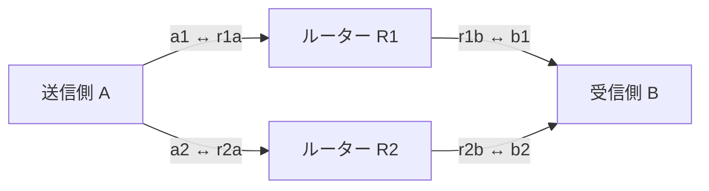

# 独自L3で期限付きメッセージを送る

Ethernetの直上に独自ヘッダを載せ、短文の優先転送、受信側による送信量の制限、期限切れの破棄、2経路への複製を比較する試作。IP・TCP・UDPは使わない。Linuxのraw socketを使う別実行ファイル `amitoki-l3` として実装している。

まず「比較試験を実行する」を読めば試せる。後半はプロトコルと設定の参照用。ネットワークとRustの開発者を対象にしている。

## 比較試験を実行する

Linux、Rust、Docker Engineを使う。Rustの準備は[本体のビルド手順](../../readme.md#ビルドする)、Dockerは[公式のUbuntu向け導入手順](https://docs.docker.com/engine/install/ubuntu/)を参照する。このcrate単体のビルドにはNode.jsとプラグインのsubmodule取得は不要。

リポジトリのルートで実行する。Dockerを実行できるユーザーで使う。

```bash
cargo test -p amitoki-l3-lab --locked
bash scripts/test-l3.sh
```

スクリプトがreleaseビルドと試験用イメージの作成を行い、外部非接続のコンテナを起動する。コンテナ内にだけvethと遅延設定を作り、終了時に削除する。イメージの初回ビルドではパッケージの取得にネットワーク接続を使う。

既定は12条件を各3秒・3回。短い確認は次で実行する。CIも同じ設定を使う。

```bash
L3_REPETITIONS=1 L3_DURATION_MS=1000 bash scripts/test-l3.sh artifacts/l3/quick
```

出力先の既定値は `artifacts/l3/<JST日付>/<時刻>/`。実験ごとに新しいディレクトリを指定する。

| ファイル | 内容 |
|---|---|
| `report.md` | 各回の期限内ACK率とRTT |
| `measurements.json` | 全ノードの計測値と試験条件 |
| `verification.json` | 成否、カーネル、実行ファイルのSHA256 |
| `<回>-<条件>/*.json` | ノード設定、起動通知、ノード別レポート |
| `<回>-<条件>/sample.pcap` | 先頭128フレームまでの実通信 |
| `<回>-<条件>/*.log` | プロセスの出力 |

失敗時は各条件の `.log` を確認する。`creditを取得できません` は、受信側から送信許可が戻らなかったことを示す。ルーター不在の条件では、この失敗を確認する。再現情報を共有する場合は、[Issue](https://github.com/amitoki/amitoki/issues)に条件と `verification.json` を添える。

## 2本の経路を独立したルーターで中継する



4プロセス・4組のvethを、1個のコンテナのネットワーク名前空間に置く。各vethにはIPアドレスを付けず、ブリッジも作らない。AとBの間には必ずRustのルーターが入る。別VMを4台使う構成ではない。

ルーターの各出力を1Mbpsに制限する。短文は128バイトを毎秒100件、背景負荷は1200バイトを毎秒500件。これは混雑を再現する条件であり、実装の最大帯域ではない。帯域計算はEthernetヘッダを含み、FCS・preamble・IFGは含まない。

| 条件 | 確かめること |
|---|---|
| `idle_fifo` / `idle_priority` | 無負荷時のFIFOと優先制御 |
| `congested_fifo` / `congested_priority` | 背景負荷がある場合の短文の遅延 |
| `delayed_single` / `delayed_dual` | 主経路に30msの遅延がある場合の1経路と2経路 |
| `delayed_no_replica_budget` | 複製帯域を0にすると複製されないこと |
| `primary_loss_dual` | 主経路の送信を100%捨てても別経路で届くこと |
| `dual_duplicates` | 同じ本文が2経路で届いても配送は1回であること |
| `receiver_limited` | 受信側が毎秒20件に送信枠を制限すること |
| `retry_delayed` | 8ms遅延・再送1回でも重複配送しないこと |
| `missing_router` | ルーターなしでは到達しないこと |

主経路の遅延・欠落はR1からBへの片方向に設定する。逆方向は正常。2経路の分だけ利用できる資源も増えるため、帯域の等しい1経路との性能比較にはなっていない。

短文の期限は既定20ms、背景負荷は200ms。再送試験だけ短文を50msにする。**期限内ACK率は、送信予定の全メッセージに対する成功率**。送信枠不足、キューの満杯、期限切れ、ACKが戻らないものも分母に含む。RTTの開始は送信予定時刻なので、ローカルで待った時間も含まれる。p50/p99は期限内ACKが返ったメッセージだけの値であり、成功率と併せて読む。

試験は配送数、送信枠と複製帯域の上限、期限、重複処理、EtherType、hop数の減算を検査する。CIではホスト負荷で変わるp99の性能閾値は設けない。

JSONの `benchmark.*.sent` は、有効な送信枠を消費して転送処理へ渡したメッセージ数。後段のキューでの破棄も含む。socketから実際に送信できたフレーム数は `network.sent` に記録する。期限切れと不正な送信枠による拒否は別々に集計する。

## 送信枠・優先キュー・期限を順に適用する

1. 送信側が `REQUEST` を送り、受信側が許可した件数を `GRANT` で返す。開始時の交換を終えてから計測する。
2. 送信側が枠を1件消費し、メッセージID・期限・本文を持つ `DATA` を出す。枠がなければその送信予定分を失敗に数える。
3. ルーターは時計、期限、hop数を確認し、宛先と経路IDで次のリンクを選ぶ。各出力の有界キューと帯域制限を通して転送する。
4. 受信側が枠と本文を検証する。最初の有効な到着だけを配送として数え、本文のfingerprintを `ACK` で返す。
5. 送信側は同じメッセージの正しいACKが期限内に戻った場合だけ成功に数える。

枠は送信元・起動ごとのsession・クラスに結び付ける。要求の再送や2経路からの同一要求は同じGRANTを返すので、許可数が増えない。短文と背景負荷には別々のtoken bucketを使う。受信側全体の毎秒の許可数を設定し、初期バーストは各32件まで。受信側が空き帯域を推定して自動調整するアルゴリズムは未実装。

優先キューは制御32件、短文32件、背景負荷128件分の空間を確保する。短文は期限が近いものから出す。制御が4件、短文が8件続いたら、待っている他クラスにも送信機会を与える。FIFO比較では同じ総容量192件を到着順で処理する。期限切れはどちらの方式でも送信前に除去する。短文の本文は最大256バイト、背景負荷は最大1400バイト。

2経路モードでは短文を複製する。同じID・枠・期限を保ち、到着順で採用する。重複には再度ACKを返す。再送は最大3回・5ms間隔で主経路を使い、複製と共通の帯域枠を消費する。既定は毎秒30,000バイト、初期バーストは最大フレーム2件分。制御要求の再送は別に5ms間隔で制限する。

配送履歴は最大8192件、発行済みGRANTは最大256件、GRANTあたり最大32枠。生存中の履歴を追い出さず、上限に達したら新規処理を拒否する。枠を使った記録はGRANTの期限まで保持し、配送履歴が期限切れになった後の再利用も拒否する。再起動するとこの状態は失われるため、再起動をまたぐ重複排除は保証しない。

## ヘッダは64バイト、経路は静的に指定する

EtherTypeはLocal Experimentalの `0x88B5`、識別子は `AMTK`、プロトコルのversionは1。[RFC 9542](https://www.rfc-editor.org/rfc/rfc9542#section-3)の実験用割当を使う。同じEtherTypeの別実験とはmagicで区別する。整数はnetwork byte order。

| オフセット | 長さ | フィールド |
|---:|---:|---|
| 0 | 4 | magic `AMTK` |
| 4 | 1 | version |
| 5 | 1 | kind: DATA=1 / ACK=2 / REQUEST=3 / GRANT=4 |
| 6 | 1 | class: short=0 / bulk=1 |
| 7 | 1 | hops: 初期値16、ルーターごとに減算 |
| 8 / 12 | 各4 | source / destinationノードID |
| 16 / 24 | 各8 | session / message ID |
| 32 / 40 | 各8 | 期限のµs / 時計ドメイン |
| 48 | 8 | credit: 上位32bitはGRANT ID、下位32bitは枠番号または許可数 |
| 56 | 2 | 本文の長さ |
| 58 / 59 | 各1 | path / flags（bit0: 複製・再送） |
| 60 | 2 | 予約領域、0固定 |
| 62 | 2 | ヘッダと本文のone's complement checksum |

ACKの本文は8バイトのFNV-1a fingerprint。REQUESTとGRANTには本文がない。checksumとfingerprintは破損検出・一致確認用で、送信元認証には使わない。

時計はLinuxの `CLOCK_MONOTONIC`。boot IDとtime namespaceの識別子を合わせたドメインが一致しないパケットを拒否する。期限が1秒を超えて先のものも拒否する。**現状は同一カーネル・同一time namespaceでの実験に限定**しており、別VM・別マシン間の時計同期は未実装。1台のVM内でこのDocker試験を動かす構成は使える。

JSON設定はノードID、リンクの相手MAC、宛先と経路ID、出力ごとの帯域を指定する。例はR1の設定。インターフェース自体は事前に作成しておく。

```json
{
  "node": 11,
  "links": [
    {"interface": "r1a", "peer_mac": "02:88:b5:00:00:01"},
    {"interface": "r1b", "peer_mac": "02:88:b5:00:00:04"}
  ],
  "routes": [
    {"destination": 1, "path": 1, "interface": "r1a"},
    {"destination": 2, "path": 1, "interface": "r1b"}
  ],
  "scheduler": "priority",
  "bytes_per_second": 125000
}
```

ノードの起動にはraw socketを開く権限が必要。比較スクリプトはコンテナ内だけに `NET_RAW` と、veth・遅延設定用の `NET_ADMIN` を付ける。各サブコマンドの設定は次で確認できる。

```bash
cargo build --release -p amitoki-l3-lab --locked
target/release/amitoki-l3 router --help
target/release/amitoki-l3 receiver --help
target/release/amitoki-l3 bench --help
```

## 本体への組み込みと実機性能は次の検証対象

この試作は生成した本文を送り、受信・ACKまでを検証する実験プログラム。アプリケーションへ任意の本文を渡すAPI、TCPのような順序付きストリーム、フラグメント、動的経路探索、暗号化・認証は持たない。通常のIPルーターを通してインターネットへ送る仕組みも含まない。

本体のRelay/Stageにはまだ組み込んでいない。本体は未知のEtherTypeのフレームも扱えるため、後から解析Stageや中継経路との組み合わせを試せる。ただし今回の時計制約を解決するまで、別マシン間への配送には使えない。

実装はAF_PACKETを使うユーザー空間のルーター。キューがある間と1ms未満の待機はbusy waitを使うため、CPU使用率は高くなる。物理NICの最大性能、AF_XDP、UDPとの同条件比較は未検証。今回の試験では、同じ実装・同じ負荷で機能を切り替えた差を見る。

受信側の許可と短文優先は[Homa](https://arxiv.org/abs/1803.09615)、複製と重複排除は[DetNetの設計](https://www.rfc-editor.org/rfc/rfc8655)を参考にしている。いずれのプロトコルの実装でもない。
