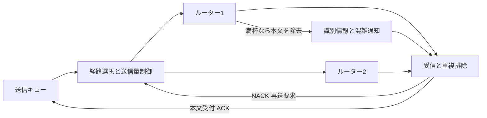

# 動的経路と混雑通知を試す

信頼性のある順序なし配送に、経路選択・送信量制御・混雑通知・trimmingを追加した。機能は個別に切り替えられる。既定はすべて無効で、設定しなければ固定経路と再送先の交替を使う。

**wire versionは2、共通ヘッダは96B。送受信側とルーターをまとめて更新する。** version 1との混在はできない。MTU 1500には最大本文1400Bまで収まる。プラグインの再構成処理・本体SDK・本体パイプラインの変更は不要。

## 送信から受付確認まで



各channelが最大8経路を持つ。設定済みの経路から、RTTと未ACKバイト数に基づく予想待ち時間が短い経路を選ぶ。経路を自動発見する機能はない。タイムアウトまたはNACKを受けた経路は100msの間、選択の優先度を下げる。使っていない経路も100ms間隔のOPENで測り、復旧後の候補に戻す。

ルーターは、実際にキューで待った時間・自ノードID・設定帯域・空き帯域の推定をパケットへ載せる。途中で最大の待ち時間を観測した出口の情報を残し、受信側がそのままACKへ返す。空き帯域は、2ms分の処理量から現在の待機バイトを引いた瞬間の推定値。物理リンクの利用率を測った値ではない。

送信量制御はchannel単位で全経路に共通のウィンドウとpacingを使う。初期値は最大フレーム4件、下限2件、上限64件。RTTやキュー待ちが増えたら減らし、ACKが戻って混雑がなければ増やす。現在の制御判断にはRTT・キュー待ち・NACKを使い、空き帯域の推定値は観測用に残す。

trimmingは、転送先のデータキューが満杯になった際に本文を除去する。channel・sequence・epoch・本文のfingerprintを残した通知を、予約済みの制御キューへ入れる。受信側はNACKを返し、送信側が対象の試行と本文を照合して別経路への再送を試す。NACKだけでは送信バッファを解放しない。同じ試行へのNACKは一度だけ作用し、再送帯域とpacingにも従う。制御キューも満杯なら通知を捨て、通常のタイムアウトで回復する。

ACKは受信キューへの受付を表す。アプリでの処理完了や永続化を保証するものではない。順序保証の有無、受信窓、再起動時の世代検査は従来どおり。

## 設定

CLIのノード設定、またはL3補助プロセスの`network`へ追加する。

```json
{
  "fabric": {
    "adaptive_paths": true,
    "congestion_control": true,
    "telemetry": true,
    "trimming": true,
    "clock_independent": true,
    "target_queue_us": 2000
  },
  "observation": "/home/ubuntu/l3/a.live.json"
}
```

| 項目 | 作用する場所 | 内容 |
|---|---|---|
| `adaptive_paths` | 送信側 | 計測値を使う経路選択 |
| `congestion_control` | 送信側 | ウィンドウとpacing |
| `telemetry` | 送信側・ルーター | 通知を要求し、転送時にキュー情報を追記 |
| `trimming` | ルーター | 満杯のデータキューで本文を除去。`priority`が必要 |
| `clock_independent` | 送信側 | reliableパケットに絶対期限を付けず、各キューで200msの滞留制限を使う |
| `target_queue_us` | 送信側 | 目標キュー待ち。100〜100000µs、既定2000µs |
| `observation` | 各ノード | 観測JSONを最大10Hzで置換保存。省略時は書き出さない |

`clock_independent`でも時計交換と時計世代の検査は続ける。初めて基準ノードの世代を取得するまでは送信しない。世代が変わったらchannelを終了する。時計精度が悪化した場合も、ローカル時計による滞留制限・配送タイムアウト・hop上限を残して通信を続ける。この指定はdeadlineモードには使えない。

`links`の各要素には`bytes_per_second`を指定できる。省略するとノード全体の設定を継承する。NICをdownにしても他のリンクの処理は継続し、downしたリンクは10msごとに再確認する。

[2026-09-28の検証結果](fabric-results-2026-09-28.md)では、コンテナ8条件と4VMの4条件で全件配送を確認した。

## コンテナとVMで検証する

[既存の準備手順](../comparison.md#準備する)に従い、Rust・Docker・Pythonを導入してから実行する。

```bash
bash scripts/test-fabric.sh artifacts/fabric/example
```

2本の経路に1Mbpsと4Mbpsの帯域を設定する。短文64Bとbulk 1200Bをそれぞれ毎秒300件、3秒間生成する。baseline、経路選択のみ、混雑制御あり、trimmingあり、全機能の5構成を比較する。追加で、trimmingを起こす1000件の短文バーストと、送信開始後に高速側のNICをdownにする条件と、down後に戻す条件を実行する。配送数・sequence・本文一致・重複・ACK照合を確認する。

4台のKVMゲストでも同じ構成を作れる。[VMの準備](../comparison.md#別カーネルのvmで確認する)を済ませ、検証済みUbuntu cloud imageとSHA256SUMSを用意する。

```bash
cargo build --release --workspace --locked
python3 comparison/verify_fabric_vm.py \
  --directory artifacts/fabric-vm/example \
  --image "$HOME/.cache/amitoki-vm/ubuntu-24.04-server-cloudimg-amd64.img"
```

送信VM・受信VM・ルーターVM×2を、QEMU socket backendの4本の独立したリンクで接続する。実験NICにIPアドレスは付けない。4台のboot IDと時計ドメインが異なること、時計を模擬していないことを検査する。既存VMには接続せず、このコマンドが起動したVMだけを終了する。通常のCIはコンテナ試験まで実行する。

`measurements.json`に条件ごとの集計、各条件のディレクトリに設定・全ノードのレポート・配送ログ、`verification.json`に実行ファイルのSHA256を保存する。VMのディレクトリにはSSH鍵もあるため、共有するファイルは集計と検証結果に限定する。

`acknowledgement_p99_upper_us`は送信キュー受付からACKまでの時間のp99上限。指数ごと8区間のヒストグラムを使うため、実際のp99より最大約12.5%大きい。予定時刻からの生成待ちは含まない。時計が異なるVMでも送信側の時計だけで測れる。

## Webで経路と制御イベントを見る

React・Vite・TypeScript・Tailwind CSSの観測画面は、このリポジトリの`web/`に置いた。Node.js 24以降とPythonがある環境で実行する。

```bash
npm ci --prefix web
npm run build --prefix web
python3 scripts/observe.py --reports artifacts/fabric/example/full
```

`http://127.0.0.1:8720`で開く。Pythonの起動は`uv run scripts/observe.py --reports ...`でもよい。指定ディレクトリの`*.live.json`を読み、なければ`*.report.json`を表示する。画面の「JSONを開く」から送信側の保存結果も読み込める。

ライブ観測では同じマシン上のプロセスが`observation`に書いたJSONを使う。VM内のファイルを自動収集する機能はない。VM試験の保存結果はホストへ回収される。ファイルの更新が止まれば「更新待ち」と表示する。経路・Short/Bulkの切替、更新停止、RTT・キュー待ち・ウィンドウ・再送・NACK・直近イベントを確認できる。イベント履歴はchannelごと128件まで保持し、画面には直近40件を表示する。

観測サーバはlocalhost専用の読み取りAPI。プラグイン設定や配送本文のログは配信しない。観測ファイルの保存先はノードごとに分ける。書き込み失敗は配送を止めず、`observation_errors`へ記録する。

## 研究から取り入れた範囲

[AWS SRD](https://aws.amazon.com/blogs/hpc/in-the-search-for-performance-theres-more-than-one-way-to-build-a-network/)の信頼性付き複数経路配送、[Google CSIG](https://research.google/pubs/csig-congestion-signaling-for-datacenter-transports/)の通信中の混雑通知、[UEC](https://ultraethernet.org/wp-content/uploads/sites/20/2026/01/UE-Specification-1.0.2-1.pdf)のtrimming、[SMaRTT](https://arxiv.org/abs/2404.01630v4)のRTT・混雑信号を使う制御を参考にした。独自のユーザー空間実装であり、各方式の再現実装や仕様準拠を示すものではない。

現時点の検証は配送と制御の機能確認。物理NICでの最大帯域、複数送信者が競合する際の公平性、incast、多数経路、長時間の安定性はまだ測っていない。TCP・SRDに対する性能上の優位性もこの試験だけでは判断できない。
