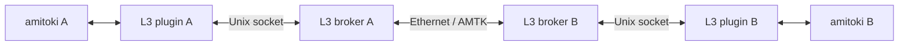

# amitokiからL3を使う

本体の再ビルドは不要。`amitoki-plugin-l3`は通常権限で動き、独立起動した`amitoki-l3-broker`へUnixソケットで接続する。補助プロセスがraw socket、時計同期、信頼性配送を担当する。本体SDKのcapability削除とループ防止は変更しない。



## ビルドと追加

Linux専用。Ubuntu/Debianのターミナルで以下を実行する。Dockerは末尾のネットワーク試験にだけ必要。

```bash
sudo apt-get update
sudo apt-get install -y build-essential git curl ca-certificates libcap2-bin python3
curl --proto '=https' --tlsv1.2 -sSf https://sh.rustup.rs | sh -s -- -y --profile minimal
. "$HOME/.cargo/env"
git clone https://github.com/amitoki/amitoki-plugin-l3.git
cd amitoki-plugin-l3
cargo build --release --workspace --locked
python3 scripts/package-plugin.py target/release/amitoki-plugin-l3 dist
amitoki plugin relay add ./dist
amitoki plugin relay describe l3
```

SDKは本体v0.4.0のGit revisionに固定している。現在は開発版で、正式なReleaseはまだ作成していない。Release公開後は`amitoki plugin relay add https://github.com/amitoki/amitoki-plugin-l3`でも追加できる。補助プロセスはCLIが自動起動・インストールしない。CIの配布物に別実行ファイルとして含める。

## L3用リンクと補助プロセス

キャプチャするLANとL3転送用NICを分ける。以下の例ではキャプチャが`eth1`、L3が`eth2`。L3用リンクにIPアドレスは不要だが、Ethernetフレームを相手MACまで届ける必要がある。通常のIPルーターやインターネットをそのまま通過することはできない。

`examples/node-a.json`をコピーし、`network.links[].interface`と`peer_mac`を実際のL3用NIC名・対向MACへ変更する。相手側は`examples/node-b.json`を使う。両側の`clock.authority`はノード2。同じprivate network内でL3の数字のノードIDを重複させない。

```bash
cp examples/node-a.json l3-node.json
sudo install -D -m 0755 target/release/amitoki-l3-broker /usr/local/libexec/amitoki-l3-broker
sudo setcap cap_net_raw=ep /usr/local/libexec/amitoki-l3-broker
install -d -m 0700 "$XDG_RUNTIME_DIR/amitoki-l3"
/usr/local/libexec/amitoki-l3-broker \
  --config "$PWD/l3-node.json" \
  --socket "$XDG_RUNTIME_DIR/amitoki-l3/relay.sock"
```

最後のコマンドは起動したままにする。`XDG_RUNTIME_DIR`が未設定なら、自分が所有する0700の専用ディレクトリの絶対パスを使う。補助プロセスはsocketを0600で作り、同じUIDのクライアントだけを受け付ける。rootで起動する場合は`--uid 対象UID`を指定し、socketは`sudo install -d -m 0711 /run/amitoki-l3`で作るroot所有のディレクトリに置く。root起動では途中の親ディレクトリもroot所有かつ他ユーザが書き換え不能であることを確認する。Ctrl+CとSIGTERMでは自分のsocketを削除する。強制終了後に残ったsocketは、補助プロセスが停止していることを確認して削除する。

1個の補助プロセスに1個の中継を接続する。同じ実行ユーザが使う同じchannel/node_id、または同一network namespace内の同じL3ノードIDを同時に占有する接続は拒否する。補助プロセスの設定変更には再起動が必要。

## 本体の設定

別のターミナルで、プラグインの設定項目を指定する。

```bash
amitoki plugin relay configure l3 --set socket_path="$XDG_RUNTIME_DIR/amitoki-l3/relay.sock"
amitoki plugin relay validate l3
```

本体の設定には次を使う。既存のfirewallとEngineの設定は用途に合わせて残す。`socket_path`は本体を実行するユーザが接続できる絶対パスにする。

```toml
node_id = "node-a"
channel = "example"
interface = "eth1"
promiscuous = true

[relay]
plugin = "l3"

[relay.options]
socket_path = "/run/user/1000/amitoki-l3/relay.sock"
```

`validate`は設定の検証であり、raw linkの疎通確認ではない。本体を起動してパケットを中継する前に、以下の専用ネットワーク試験で動作を確認できる。

## 配送契約と上限

- `publish`は指定した全peerへのL3受信受付を待つ。相手NICへの送信や永続化の確認ではない。失敗時は部分成功があり、同じFrame.idで再試行する。
- Ethernetフレームは14〜65,535B。1,292Bごとの断片に分け、UUID・全長・channelのSHA256・本文のSHA256を付ける。再構成時に本文を照合し、完成したフレームだけを本体へ渡す。
- 配送は順序なし。短いフレームはshort、断片化が必要なフレームはbulkとして送る。同じフレーム内の断片の到着順も問わない。
- `receive`は非破壊。`acknowledge`まで保持する。受領情報には世代ごとの値を付け、古いACKが別の受付を削除することを防ぐ。
- 再構成中と未ACKの合計は既定256フレーム、最大16MiB。ACK後の重複履歴は60秒、最大65,536件。保持中の履歴を追い出さず、満杯なら新規受付を止める。期限回収は1秒周期。再構成途中で60秒進まなかったものは解放する。長時間ACKしない相手や履歴上限は送信速度を制限する。
- 1回のpublishは128フレーム、peerは最大8。送信待ちも有界。8秒で確認できなければ未確認として返す。これは負荷や回線断時にも成功を保証するという意味ではない。
- キュー・重複履歴はメモリのみ。補助プロセスの終了や接続の作り直しで失われる。通信断は本体に停止が必要なエラーを返す。状態を捨てる自動再接続は行わず、中継を再起動する。
- L3自身の`AMTK`フレームをpublishすると拒否する。転送NICの分離と本体側のループ防止も必要。

SHA256やsessionは通信相手の認証ではない。現在のL3は信頼できるprivate networkを前提にし、暗号化・インターネット越しのNAT越えは実装していない。

## 検証する

```bash
cargo test --workspace --locked
bash scripts/test-plugin.sh
```

試験は外部非接続コンテナに、IPなしのvethを3組作る。3個の補助プロセスと3個のプラグインを起動し、本体SDKの`ProcessRelay`経由で14/64/1514/65535Bを相互配送する。全本文・重複排除・非破壊取得・繰り返しACK・重複接続の拒否を検証し、プラグインの`CapEff=0`も確認する。ホストのNIC・経路は変更しない。

L3 CLIのTCP比較は補助プロセスとstdioを通さない。したがって、そのMbpsをそのまま本体プラグインの処理速度とは扱わない。
